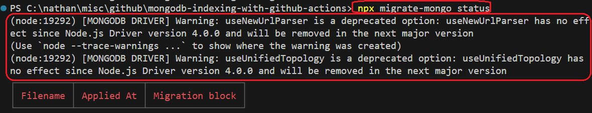
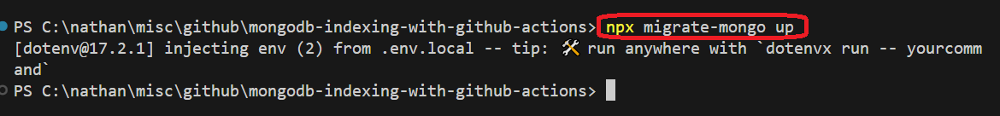

<h1>Project Name</h1>
Create <strong>MongoDB</strong> Indexing with <strong>migrate-mongo</strong> and <strong>GitHub Actions</strong>

<h2>Project Description</h2>
This project demonstrates a robust and automated solution for managing MongoDB database schema changes, with a specific focus on creating and applying performance-critical indexes, across multiple environments (development, preview, and production). Leveraging `migrate-mongo` for version-controlled database migrations and integrating seamlessly with GitHub Actions for CI/CD, this setup ensures consistent, repeatable, and secure database updates, making it ideal for small teams with simple yet critical database management needs.

<h2>Motivation</h2>
<p>You have three <strong>environments</strong>: dev, preview, and production, and you have a <strong>MongoDB</strong> database. You want to create <strong>indexing</strong> for <strong>performance</strong> on all <strong>environments</strong> in a <strong>consistent</strong> way – how do you achieve this?</p>

<p>Given my knowledge with <strong>GitHub Actions</strong>, automating it with this tool is a natural <strong>choice</strong>.</p>

<p>But what else is needed?</p>

<p>For <strong>small teams with simple needs</strong>, <code>migrate-mongo</code> is the missing piece.</p>

<p>Using <strong>GitHub Actions</strong>, you get <strong>Trackable changes</strong> (versioned, reviewed in Git) out of the box.</p>

<p>Another issue is how to create the <strong>indexing</strong> – <strong>can I create it from a MongoDB schema? Does such a concept exist?</strong></p>


<h2>Installation</h2>

  <p>To get started with <code>migrate-mongo</code> in your Node.js project, follow these steps:</p>

  <h3>1. Install <code>migrate-mongo</code> Package</h3>
  <p><code>migrate-mongo</code> is typically installed as a development dependency. This is because it's a tool used for managing database changes during your development and deployment workflows, rather than a runtime dependency for your live application code.</p>

```javascript
pnpm i -D migrate-mongo
```

You can also use npm or yarn

  <h3>2. Initialize <code>migrate-mongo</code> Project</h3>
  <p>After installing the package, you need to initialize <code>migrate-mongo</code> in your project's root directory. This command sets up the necessary configuration file and creates a dedicated directory for your migration scripts.</p>
  
  ```bash
  npx migrate-mongo init
```

This is the created migrate-mongo-config.js file

```javascript
// In this file you can configure migrate-mongo

const config = {
  mongodb: {
    // TODO Change (or review) the url to your MongoDB:
    url: "mongodb://localhost:27017",

    // TODO Change this to your database name:
    databaseName: "YOURDATABASENAME",

    options: {
      useNewUrlParser: true, // removes a deprecation warning when connecting
      useUnifiedTopology: true, // removes a deprecating warning when connecting
      //   connectTimeoutMS: 3600000, // increase connection timeout to 1 hour
      //   socketTimeoutMS: 3600000, // increase socket timeout to 1 hour
    },
  },

  // The migrations dir, can be a relative or absolute path. Only edit this when really necessary.
  migrationsDir: "migrations",

  // The MongoDB collection where the applied changes are stored. Only edit this when really necessary.
  changelogCollectionName: "changelog",

  // The MongoDB collection where the lock will be created.
  lockCollectionName: "changelog_lock",

  // The value in seconds for the TTL index that will be used for the lock. Value of 0 will disable the feature.
  lockTtl: 0,

  // The file extension to create migrations and search for in migration dir
  migrationFileExtension: ".js",

  // Enable the algorithm to create a checksum of the file contents and use that in the comparison to determine
  // if the file should be run.  Requires that scripts are coded to be run multiple times.
  useFileHash: false,

  // Don't change this, unless you know what you're doing
  moduleSystem: "commonjs",
};

module.exports = config;
```

  <p>This command performs two key actions:</p>
  <ul>
    <li>It creates a <code>migrate-mongo-config.js</code> file in your project's root. This file is crucial for configuring your MongoDB connection details and migration settings.</li>
    <li>It creates a <code>migrations/</code> directory in your project's root. This is the designated location where all your individual migration script files (written in JavaScript) will reside.</li>
  </ul>

  <h3>3. Configure <code>migrate-mongo-config.js</code></h3>
  <p>Open the <code>migrate-mongo-config.js</code> file that was just generated. You need to configure this file to tell <code>migrate-mongo</code> how to connect to your MongoDB databases for each of your environments (development, preview, production).</p>
  <p><strong>Key properties to configure:</strong></p>
  <ul>
    <li><strong><code>mongodb.url</code></strong>: Your MongoDB connection string. It's best practice to use environment variables for this, especially when dealing with different environments, to avoid hardcoding sensitive credentials.</li>
    <li><strong><code>mongodb.databaseName</code></strong>: The specific database within your MongoDB instance that <code>migrate-mongo</code> should manage.</li>
  </ul>

This is the file after changes

```javascript

// Load environment variables from .env.local file (for local development)
require('dotenv').config({ path: '.env.local' });

const config = {
  mongodb: {
    // These will now be populated from your .env file locally,
    // or from GitHub Actions secrets when deployed.
    url: process.env.MONGODB_URI , // --- connection string
    databaseName: process.env.MONGODB_DB_NAME ,

options: {
      //useNewUrlParser: true, // removes a deprecation warning when connecting
      //useUnifiedTopology: true, // removes a deprecating warning when connecting
      //   connectTimeoutMS: 3600000, // increase connection timeout to 1 hour
      //   socketTimeoutMS: 3600000, // increase socket timeout to 1 hour
    }
  },
  ...... 

}

```

<h2>Usage</h2>
<p>Once <code>migrate-mongo</code> is installed and configured, you can start creating and applying your database migrations using its command-line interface (CLI).</p>

<h3>1. Create a New Migration Script</h3>
<p>Whenever you need to make a change to your database schema (e.g., adding an index, creating a new collection, modifying a field), you create a new migration file.</p>
<pre><code>npx migrate-mongo create &lt;a_descriptive_migration_name&gt;
</code></pre>
<p><strong>Example:</strong></p>
<pre><code>npx migrate-mongo create add_user_wallet_indexes
</code></pre>
<p>This command will generate a new JavaScript file in your <code>migrations/</code> directory. The filename will typically include a timestamp followed by your descriptive name (e.g., <code>20250728065805-add_user_wallet_indexes.js</code>). The timestamp ensures migrations are applied in the correct chronological order.</p>

<h3>2. Write Your Migration Logic (in the created <code>.js</code> file)</h3>
<p>Open the newly created migration file. It will contain two asynchronous functions: <code>up</code> and <code>down</code>.</p>
<ul>
  <li>The <strong><code>up</code> function</strong> contains the logic to apply your database changes (e.g., create indexes, add new fields, insert initial data).</li>
  <li>The <strong><code>down</code> function</strong> contains the logic to reverse or undo the changes made in the <code>up</code> function. This is crucial for rollbacks or if you need to revert a deployment.</li>
</ul>
<p>Both functions receive a <code>db</code> object (a native MongoDB driver <code>Db</code> instance) and a <code>client</code> object (a native MongoDB driver <code>MongoClient</code> instance), which you use to interact with your MongoDB database.</p>

<p><strong>Example <code>migrations/20250728065805-add_user_wallet_indexes.js</code>:</strong></p>

```javascript
const TRANSACTIONS_COLLECTION = "transactions";
const USER_PAYMENT_PROFILES_COLLECTION = "user_payment_profiles";

module.exports = {
  async up(db, client) {
    console.log(
      `Applying migration: Creating indexes on ${TRANSACTIONS_COLLECTION}...`
    );

    // Scenario 1: Compound Index for efficient user history lookup
    await db
      .collection(TRANSACTIONS_COLLECTION)
      .createIndex(
        { clerkUserId: 1, timestampUTC: -1 },
        { name: "idx_transactions_clerkUserId_timestampUTC" } 
      );
    console.log("Created compound index: idx_transactions_clerkUserId_timestampUTC"); 

    // Scenario 2: Unique Index for Braintree Transaction ID lookup and data integrity
    await db
      .collection(TRANSACTIONS_COLLECTION)
      .createIndex(
        { braintreeTransactionId: 1 },
        { unique: true, name: "idx_transactions_braintreeTransactionId_unique" } 
      );
    console.log("Created unique index: idx_transactions_braintreeTransactionId_unique");

    console.log(
      `Applying migration: Creating indexes on ${USER_PAYMENT_PROFILES_COLLECTION}...`
    );

    // Index for user_payment_profiles collection using clerkUserId
    await db
      .collection(USER_PAYMENT_PROFILES_COLLECTION)
      .createIndex(
        { clerkUserId: 1 },
        { unique: true, name: "idx_userPaymentProfiles_clerkUserId_unique" }
      );
    console.log(
      `Created unique index: idx_userPaymentProfiles_clerkUserId_unique`
    );
  },

  async down(db, client) {
    console.log(
      `Reverting migration: Dropping indexes from ${TRANSACTIONS_COLLECTION}...`
    );
    await db
      .collection(TRANSACTIONS_COLLECTION)
      .dropIndex("idx_transactions_clerkUserId_timestampUTC"); 
    console.log(
      `Dropped compound index: idx_transactions_clerkUserId_timestampUTC`
    );
    await db
      .collection(TRANSACTIONS_COLLECTION)
      .dropIndex("idx_transactions_braintreeTransactionId_unique"); 
    console.log(
      `Dropped unique index: idx_transactions_braintreeTransactionId_unique`
    );

    console.log(
      `Reverting migration: Dropping indexes from ${USER_PAYMENT_PROFILES_COLLECTION}...`
    );
    await db
      .collection(USER_PAYMENT_PROFILES_COLLECTION)
      .dropIndex("idx_userPaymentProfiles_clerkUserId_unique");
    console.log(
      `Dropped unique index: idx_userPaymentProfiles_clerkUserId_unique`
    );
  },
};
```

<h3>3. Run <code>migrate-mongo</code> CLI Commands</h3>
<p>Once your migration script is ready, you'll use <code>migrate-mongo</code>'s CLI commands to manage the application of these changes to your database.</p>

<ul>
  <li><strong>Check Migration Status:</strong>
    <p>To see which migrations are pending (not yet applied) and which have already been applied to your database:</p>

```bash
npx migrate-mongo status
```

    <p>This helps you understand the current state of your database schema across environments.</p>

  </li>
  <li><strong>Apply Pending Migrations:</strong>
    <p>To run all migrations in the <code>migrations/</code> directory that have not yet been applied to the database:</p>
    
  ```bash
  npx migrate-mongo up
  ```

    <p>This command executes the <code>up</code> function of each pending migration script in chronological order. <code>migrate-mongo</code> logs the successful application of each migration in its <code>changelog</code> collection within your database.</p>

  </li>
  <li><strong>Rollback the Last Migration:</strong>
    <p>To revert the most recently applied migration (by executing its <code>down</code> function):</p>
    
  ```bash
  npx migrate-mongo down
  ```
    
  <div>
    <p><strong>Important Note on Rollbacks:</strong> This is useful for local development or for quickly undoing a faulty deployment in a non-production environment. <strong>Use with extreme caution in production</strong>, as data changes made by the <code>up</code> script might not be perfectly reversible and could lead to data loss or corruption.</p>
  </div>
  </li>
</ul>

<h3>Integration with GitHub Actions</h3>
<p>In your GitHub Actions workflow (defined in <code>.github/workflows/*.yml</code> files), you will integrate these <code>npx migrate-mongo</code> commands within your <code>run</code> steps. You'll dynamically provide the <code>MONGODB_URI</code> and <code>MONGODB_DB_NAME</code> environment variables (ideally from GitHub Secrets for security) to ensure your workflows target the correct MongoDB database for each environment (development, preview, production).</p>

```yaml
# Example snippet for a GitHub Actions workflow that runs migrations
jobs:
deploy:
  runs-on: ubuntu-latest
  # IMPORTANT: To target a specific GitHub Environment and its secrets (e.g., 'production'),
    # you MUST add an 'environment:' key to this job.
    # For example:
    # environment: production

  steps:
    - uses: actions/checkout@v4
    - name: Setup Node.js
      uses: actions/setup-node@v4
      with:
        node-version: "20" # Or your desired Node.js version

    - name: Install Project Dependencies
      run: pnpm ci # Use 'pnpm ci' for clean, consistent installs in CI environments

    - name: Run Database Migrations (e.g., for production environment)
      env:
        # These secrets must be configured in your GitHub repository settings
        MONGODB_URI: ${{ secrets.MONGODB_URI }}
        MONGODB_DB_NAME: ${{ secrets.MONGODB_DB_NAME }}
        # Optionally, if your migrate-mongo-config.js is not in the root:
        # MIGRATE_MONGO_CONFIG: './path/to/migrate-mongo-config.js'
      run: npx migrate-mongo up
```

<h2>Technologies Used</h2>
<ul>
  <li><strong>migrate-mongo:</strong> A database migration tool for Node.js, used to version control and apply schema changes (including indexes) to MongoDB databases.</li>
  <li><strong>MongoDB:</strong> A popular, flexible NoSQL document database.</li>
  <li><strong>MongoDB Atlas:</strong> The fully managed cloud database service for MongoDB, hosting your database clusters.</li>
  <li><strong>GitHub Actions:</strong> A CI/CD platform used to automate workflows, including deploying code and running database migrations across different environments.</li>
</ul>

<h2>Introduction to MongoDB indexing</h2>

<p>MongoDB indexes are like a <strong>book's index</strong>: ordered references that allow the database to <strong>quickly locate data</strong> without scanning every document. They're vital for <strong>fast query performance</strong>.</p>

<ul>
  <li><strong>Why Needed:</strong> Without them, queries perform slow "collection scans."
    <ul>
      <li><strong>Sample:</strong> <code>db.users.find({ email: "alice@example.com" })</code> - <em>Needs an index on <code>email</code>.</em></li>
    </ul>
  </li>
  <li><strong>How They Work:</strong> Typically B-tree structures store sorted field values with pointers to documents.</li>
  <li><strong>Benefits:</strong> Speeds up lookups, sorting, and enforces uniqueness.
    <ul>
      <li><strong>Sample (Sorting):</strong> <code>db.videos.find().sort({ creationDate: -1 })</code> - <em>Needs an index on <code>creationDate</code>.</em></li>
      <li><strong>Sample (Unique):</strong> <code>db.users.createIndex({ username: 1 }, { unique: true })</code></li>
    </ul>
  </li>
</ul>

<p><strong>Key Takeaway:</strong> Index strategically on frequently queried fields for optimal read performance, balancing against write overhead.</p>

<h2>Example: Indexing a User Wallet Top-Up Transaction</h2>

<p>Let's use a common payment transaction from your "post2video" app to illustrate the importance of indexing. Imagine your <code>transactions</code> collection stores records like this:</p>

```json
{
  "_id": { "$oid": "68830e18d6a1c610277767cc" },
  "clerkUserId": "user_abc_4321", // Unique ID for your application's user
  "type": "top_up", // "top_up", "payment_out", "refund"
  "amountMillicents": 7000, // Amount in millicents (7.00 USD)
  "currency": "USD",
  "timestampUTC": { "$date": "2025-07-25T04:54:48.163Z" }, // When transaction occurred
  "description": "Braintree top_up for $7.00",
  "status": "completed", // "pending", "completed", "failed"
  "braintreeTransactionId": "mqj10hxj", // ID from Braintree payment gateway
  "braintreeCustomerId": "user_abc_4321",
  "paymentMethodDetails": {
    "token": "5c76rw3t",
    "type": "Visa",
    "last4": "0061"
  },
  "initialBalanceMillicents": 96000,
  "finalBalanceMillicents": 103000
}
```

<p>Now, let's look at two common query scenarios:</p>

<h3>Scenario 1: Finding All Wallet Transactions for a Specific User, Sorted by Most Recent</h3>
<p>Users will frequently check their payment history, wanting to see the newest transactions first. This is a critical feature for your app's user experience.</p>

<p><strong>The Query:</strong></p>
<pre><code>
db.transactions.find({ clerkUserId: "user_abc_4321" })
                      .sort({ timestampUTC: -1 });
</code></pre>

<p><strong>Impact of Indexing:</strong></p>
<ul>
  <li><strong>WITHOUT a Compound Index on <code>clerkUserId</code> and <code>timestampUTC</code>:</strong>
    <ul>
      <li>MongoDB would likely perform a <strong><code>COLLSCAN</code></strong> (Collection Scan), reading every document.</li>
      <li>It would then filter for the <code>clerkUserId</code>.</li>
      <li>Finally, it would perform a slow, <strong>in-memory sort</strong> of all matching transactions by <code>timestampUTC</code>.</li>
      <li><strong>Result:</strong> <strong>Very Slow</strong> query times, especially for popular users or a large collection. High server resource consumption.</li>
    </ul>
  </li>
  <li><strong>WITH a Compound Index on <code>clerkUserId</code> and <code>timestampUTC</code>:</strong>
    <pre><code>db.transactions.createIndex({ clerkUserId: 1, timestampUTC: -1 });</code></pre>
    <ul>
      <li>MongoDB uses this compound index (<strong><code>IXSCAN</code></strong>). It efficiently locates all documents for the given <code>clerkUserId</code>.</li>
      <li>Crucially, because <code>timestampUTC</code> is also part of the index and in descending order (<code>-1</code>), the results for that user are <strong>already pre-sorted</strong> as they are read from the index. MongoDB avoids the expensive in-memory sort.</li>
      <li><strong>Result:</strong> <strong>Extremely Fast</strong> retrieval of user payment history (milliseconds), even with millions of transactions. Low server load.</li>
    </ul>
  </li>
</ul>

<h3>Scenario 2: Quickly Looking Up a Transaction by its Braintree ID</h3>
<p>For customer support or internal reconciliation, you often need to find a specific transaction using the unique ID from your payment gateway.</p>

<p><strong>The Query:</strong></p>
<pre><code>
db.transactions.find({ braintreeTransactionId: "mqj10hxj" });
</code></pre>

<p><strong>Impact of Indexing:</strong></p>
<ul>
  <li><strong>WITHOUT an Index on <code>braintreeTransactionId</code>:</strong>
    <ul>
      <li>MongoDB performs a <strong><code>COLLSCAN</code></strong>, reading every document until it finds the matching ID.</li>
      <li><strong>Result:</strong> Slow, inefficient lookups, particularly if the transaction is deep within a large collection.</li>
    </ul>
  </li>
  <li><strong>WITH a Unique Index on <code>braintreeTransactionId</code>:</strong>
    <pre><code>db.transactions.createIndex({ braintreeTransactionId: 1 }, { unique: true });</code></pre>
    <ul>
      <li>MongoDB uses this unique index (<strong><code>IXSCAN</code></strong>) to <strong>instantly pinpoint</strong> the exact document.</li>
      <li>The <code>unique: true</code> option also <strong>ensures data integrity</strong>, preventing accidental duplicate records for the same Braintree transaction.</li>
      <li><strong>Result:</strong> <strong>Instantaneous</strong> lookups (sub-millisecond), highly reliable, and enforces data quality. This is also vital for fast <strong>update operations</strong> on this specific transaction.</li>
    </ul>
  </li>
</ul>

<p>These examples demonstrate how specific indexes, tailored to your application's common query patterns, are essential for ensuring a fast, reliable, and scalable payment system within your "post2video" SaaS.</p>

<h2>Design</h2>

<h3> why migrate-mongo and not mongodb driver </h3>
  <p>You're right to ask this question, especially since you're already leveraging the power of GitHub Actions for automation. While the MongoDB driver is the fundamental tool for interacting with your database, <code>migrate-mongo</code> provides a crucial layer of management and organization that the raw driver doesn't.</p>

  <p>Think of it like this:</p>

  <ul>
    <li>
      <h3>The MongoDB Driver: The "Engine"</h3>
      <p>The MongoDB driver is like the <strong>engine</strong> of a car. It allows you to perform direct actions on your database: create collections, insert documents, build indexes, and so on. You can tell it to "create an index" or "update a document," and it will execute that command.</p>
    </li>
    <li>
      <h3><code>migrate-mongo</code>: The "GPS Navigation System with a Logbook"</h3>
      <p><code>migrate-mongo</code>, on the other hand, is like a <strong>GPS navigation system with a built-in logbook</strong> for your database's evolution. It <em>uses</em> the car's engine (the MongoDB driver) to perform actions, but it adds critical features for managing your database schema over time:</p>
      <ul>
        <li><strong>State Tracking ("Where am I?"):</strong> It remembers which specific database changes (migrations) have <strong>already been applied</strong> to a particular database. The raw driver doesn't inherently track this; it just executes whatever command you give it.</li>
        <li><strong>Order & Versioning ("What's next?"):</strong> It ensures that your database changes are applied in the <strong>correct, predefined sequence</strong>, every single time. This is vital as your application evolves and requires multiple, sequential database modifications.</li>
        <li><strong>Consistency Across Environments ("Have I been here before?"):</strong> By tracking applied migrations, <code>migrate-mongo</code> prevents you from accidentally running the same change twice on the same database. This helps keep all your development, staging, and production environments in a consistent, synchronized state.</li>
        <li><strong>Automated & Repeatable Workflow:</strong> It provides a standardized way to define, run, and even roll back database changes. This is especially powerful when integrated with tools like GitHub Actions, allowing for reliable, automated deployments of database schema updates alongside your application code.</li>
        <li><strong>Team Collaboration:</strong> In a team environment, developers can independently create migration scripts for their features. <code>migrate-mongo</code> handles the merging and application of these scripts in the correct order when deployed.</li>
      </ul>
    </li>
  </ul>

  <p>In short, while the MongoDB driver gives you the power to interact with your database, <code>migrate-mongo</code> provides the <strong>structured, version-controlled, and automated framework</strong> necessary for safely and efficiently managing your database schema changes throughout your application's lifecycle, especially in a continuous integration/continuous deployment (CI/CD) environment like GitHub Actions.</p>

<h2>Demo</h2>

.env.local (development)


first ever migrate-mongo status



npx migrate-mongo create add_user_wallet_indexes


the file 20250728065805-add_user_wallet_indexes.js is created but it is just template for up and down. as shown here


so put there the code from the readme 

npx migrate-mongo up => create index for collections : transactions and user_payment_profiles


now lets check status


if you try another npx migrate-mongo up with no changes you will get



and status


You might wonder how migrate-mongo remembers not to apply changes if they've already been done. This is achieved by adding a collection named changelog to your database, as follows:


<h2>Limitation - Environment Handling in GitHub Actions</h2>

For simplicity in this demonstration, the provided GitHub Actions workflow snippet shows a single job for running migrations. In a full multi-environment setup (development, preview, production), you would typically:
1.  Have separate jobs (or even separate workflows) for each environment.
2.  Each job would be explicitly linked to its corresponding GitHub Environment (e.g., `environment: production`) to correctly load environment-specific secrets.
3.  Conditional logic (e.g., based on branches or manual triggers) would then control which environment's migration job gets executed.

While this guide focuses on the core integration of `migrate-mongo` and GitHub Actions, implementing the full branching and environment-specific deployment logic for all three environments is a more advanced topic and is outside the direct scope of this simplified example.

<h2>Points of Interest</h2>
<ul>
    <li><strong>Environment-Specific Configuration:</strong> The connection string (including database name, username, and password) must be handled via **environment variables**. For local development, use a <code>.env.local</code> file with the <code>dotenv</code> package. For CI/CD, leverage **GitHub Actions Environments** and their dedicated secrets to securely manage credentials for development, preview, and production.
        <ul>
            <li><strong>Important:</strong> Collection names (e.g., "transactions", "changelog") should remain consistent across all environments to ensure migrations apply correctly.</li>
        </ul>
    </li>
    <li><strong>Database Backup Strategy:</strong> Avoid committing database backups (even JSON exports) directly into your Git repository for security and repository size reasons. Use dedicated database backup services (like MongoDB Atlas automated backups) or secure cloud storage solutions. The provided transaction JSON is illustrative for the document, not a backup to be versioned.</li>
    <li><strong>Migration Timestamps:</strong> <code>migrate-mongo</code> automatically prefixes migration filenames with a timestamp (e.g., <code>20250728065805-add_user_wallet_indexes.js</code>). This timestamp is crucial for ensuring migrations are applied in the **correct chronological order** across all environments, regardless of Git commit order or concurrent development. Workflow files do not require timestamps as their execution order is determined by GitHub Actions' internal logic and defined workflow steps.</li>
    <li><strong>MongoDB Driver Deprecations:</strong> If you encounter warnings like `useNewUrlParser` or `useUnifiedTopology` being deprecated, you can safely remove these options from your `migrate-mongo-config.js` file as they have no effect in modern MongoDB Node.js driver versions (4.0.0+).</li>
    <li><strong>TypeScript Support:</strong> While this guide uses JavaScript for simplicity, <code>migrate-mongo</code> supports TypeScript for migration files. You can configure your project to use <code>.ts</code> migration files if preferred.</li>
</ul>


<h2>References</h2>
<ul>
    <li><a href='https://www.npmjs.com/package/migrate-mongo'>migrate-mongo official docs</a></li>
</ul>
